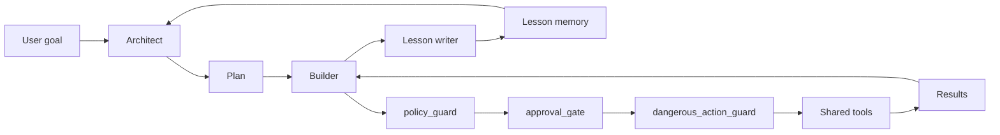
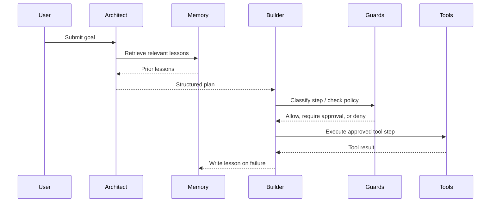

# dual-agent-platform

> Tool-first, safety-gated multi-agent execution for GCP data engineering and SDLC story orchestration.

[](#)
[](#)
[](#)
[](#)

A dual-agent platform built for **auditable execution**, **deterministic safety**, and **tool-first task completion**. It is designed to run inside Claude Code, Cursor, and GitHub Copilot through repository-level instructions, with an Architect -> Builder workflow, reusable Python tool layer, safety guards, reducers, and JSONL lesson memory.

## Why this repo

Most agent systems default to generating ad hoc code for every task. This repository enforces the opposite default: **use prebuilt, testable tools first; generate code only when no tool fits**.

- Safer execution with explicit policy evaluation and approval gates.
- Better auditability through structured handoff and deterministic guardrails.
- More reusable automation through shared tools instead of one-off generated scripts.
- Faster iteration through reducers, memory retrieval, and focused domain agents.

## Key capabilities

| Capability | What it does |
| --- | --- |
| Architect + Builder runtime | Separates planning from execution with a structured plan handoff. |
| Domain agents | Includes a GCP Data Engineering Agent and a Story Orchestration Agent. |
| Safety stack | Routes actions through `policy_guard`, `approval_gate`, and `dangerous_action_guard`. |
| Lesson memory | Retrieves lessons before planning and writes lessons on failure. |
| Reducers | Compresses high-volume context such as schemas, logs, errors, indexes, and SQL templates. |
| Shared tool layer | Reuses Python tools across domains instead of regenerating logic per task. |
| CI checks | Runs Ruff and pytest on every push. |

## Architecture

The Architect decides **what** should happen; the Builder decides **how** to execute each approved step through the shared tool layer.



### Runtime flow



## Quick start

```bash
pip install -e .
pytest -q
python -m agents.architect --goal "Backfill BQ table x.y for last 7 days"
python -m agents.builder --plan plan.json
```

## How it works

### 1. Plan with context

The Architect retrieves relevant lessons before planning, allowing prior failures and known constraints to shape the plan.

### 2. Execute through guards

Each Builder step is routed through the safety chain:

- `policy_guard`
- `approval_gate`
- `dangerous_action_guard`

Mutating actions are classified before execution. Unknown verbs fail closed, destructive dataset-scope operations are denied by default, and item-scope destructive actions require approval.

### 3. Learn from failures

The platform writes lessons to append-only JSONL memory under `$DAP_MEMORY_DIR`. Those lessons are available for retrieval during future planning, enabling lightweight self-correction without hiding execution details.

## Project structure

```text
agents/           # Architect, Builder, GCP DE Agent, Story Orchestration Agent
docs/             # Usage, architecture, agents, safety, memory, tools, testing, release, dev
prompts/          # System prompts and skill prompts
tests/            # Safety, memory, smoke e2e, and core contract tests
tools/
  core/           # Shared contracts such as ToolResult and RiskLevel
  gcp/            # bq, gcs, logging, cloud_run, vertex, discovery_engine
  integrations/   # jira, confluence, github, mcp
  reducers/       # policy_guard, schema_fingerprint, log_clusterer, and more
  safety/         # approval_gate, dangerous_action_guard, policies.json
  memory/         # memory_store, lesson_writer, lesson_retriever
.cursor/rules/    # Cursor rule files
.github/          # Copilot instructions and CI workflow
```

## Example workflow

1. Define a goal for the Architect.
2. Let the Architect produce a structured plan.
3. Pass that plan to the Builder.
4. Let the Builder evaluate each step through the safety chain.
5. Execute approved steps through shared tools.
6. Persist lessons when execution fails.

Well suited to:

- GCP data engineering operations with reusable tool wrappers.
- Story or SDLC orchestration where actions need reviewable execution boundaries.
- Agent workflows where auditability matters more than opaque autonomy.

## Documentation

| Topic | Path |
| --- | --- |
| Usage and commands | [`docs/usage.md`](docs/usage.md) |
| Architecture | [`docs/architecture.md`](docs/architecture.md) |
| Agents | [`docs/agents.md`](docs/agents.md) |
| Safety and approvals | [`docs/safety.md`](docs/safety.md) |
| Memory and self-correction | [`docs/memory-and-self-correction.md`](docs/memory-and-self-correction.md) |
| Tools and reducers | [`docs/tools.md`](docs/tools.md) |
| Testing | [`docs/testing.md`](docs/testing.md) |
| Development | [`docs/development.md`](docs/development.md) |
| Release process | [`docs/release-process.md`](docs/release-process.md) |

## Development

- Contributing guide: [`CONTRIBUTING.md`](CONTRIBUTING.md)
- AI assistant operating contract: [`CLAUDE.md`](CLAUDE.md)
- Cursor rules: [`.cursor/rules/`](.cursor/rules)
- CI configuration: [`.github/`](.github)

Local validation:

```bash
pytest -q
```

## Roadmap

This repository is **pre-release**. The public surface already includes the Architect/Builder runtime, safety stack, memory store, reducers, and GCP/integration tool wrappers, while maturity varies by component.

- Expanding and hardening shared tool coverage.
- Growing domain-agent documentation and usage examples.
- Continuing to refine safety policy behavior and approval routing.
- Improving release and contributor ergonomics as the platform stabilizes.

## Contributing

Contributions are welcome. For substantial changes, start with a short design discussion in an issue before implementation.

- [`CONTRIBUTING.md`](CONTRIBUTING.md)
- [`CODE_OF_CONDUCT.md`](CODE_OF_CONDUCT.md)
- [`SECURITY.md`](SECURITY.md)
- [`SUPPORT.md`](SUPPORT.md)

## License

License intent is not yet declared. Maintainer confirmation is needed before public adoption.
