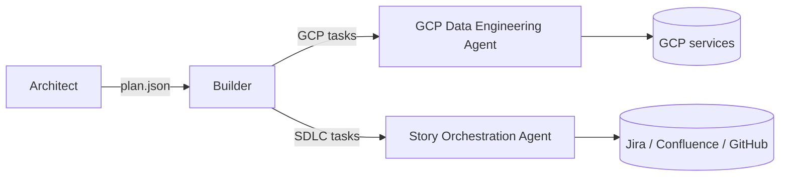
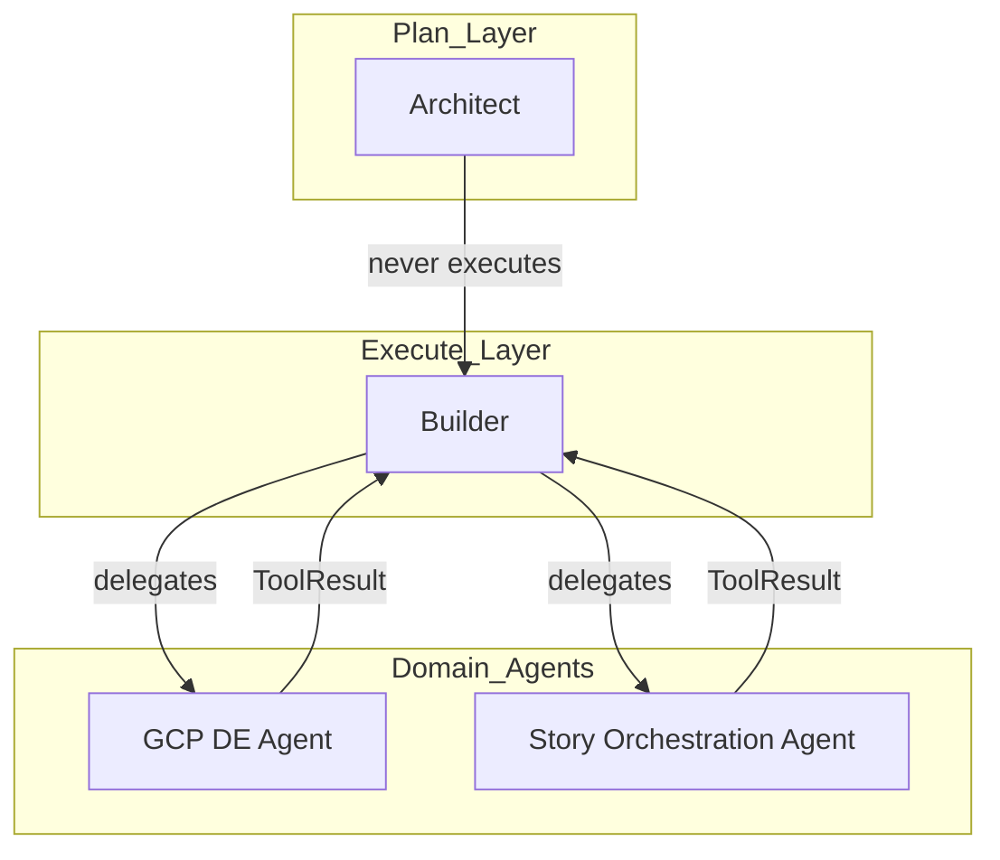

# Agents

The platform ships four cooperating agents. Each has a clear scope and delegates outside of it.

## Architect (`agents/architect/`)

**Role:** plan a goal into structured steps and route risky steps to approval.

**Inputs:** user goal, prior lessons, repo/schema indexes.
**Outputs:** plan JSON containing ordered steps with verb, target, scope, reversibility, and approval requirements.

**Boundaries:**
- Never executes mutating operations.
- Always retrieves lessons before planning.
- Always classifies each step via `policy_guard`.

## Builder (`agents/builder/`)

**Role:** execute plan steps via the shared tool layer.

**Inputs:** plan JSON, approval tokens (when required).
**Outputs:** per-step structured results (`ToolResult`) and an aggregate report.

**Boundaries:**
- Never replans; if a step fails, it writes a lesson and returns control.
- Never bypasses the safety chain.
- Never persists secrets/PII to memory or evidence.

## GCP Data Engineering Agent (`agents/gcp_data_engineering_agent/`)

**Domains:** GCS, BigQuery, Cloud Logging, Cloud Run, Discovery Engine, Vertex AI, IAM-aware ops.

**Rules:**
- Use existing Python tool wrappers first.
- Treat tools as the execution boundary; the LLM is planner/interpreter.
- Return structured outputs: action, resources, summary, evidence, next steps.
- Risky operations require explicit confirmation. Prefer idempotent operations.

## Story Orchestration Agent (`agents/story_orchestration_agent/`)

**Connected systems:** Jira, Confluence, Git/GitHub, MCP services, GCP Data Engineering Agent.

**Responsibilities:** read story -> plan -> delegate cloud ops -> implement -> test -> collect evidence -> PR -> lower-env deploy -> status updates.

**Boundaries:**
- Does not perform GCP mutations directly; delegates to the GCP agent.
- Updates Jira/Confluence only after evidence is captured.

## Delegation rules

- Story Orchestration -> GCP Data Engineering: for any cloud op.
- Architect -> Builder: for any plan execution.
- Domain agents -> Architect/Builder: for cross-cutting orchestration.

## Handoff contract

```
Architect emits plan.json
  -> Builder ingests plan.json
    -> Builder reports per-task JSON
      -> Architect reviews
        -> ships or replans
```

Plan and report schemas are stable in spirit but versioned alongside `tools/core/contracts.py`.

## When to use a tool vs prompt reasoning

- Determinism, side effects, or external systems => tool.
- Summarization, classification, or reduction => reducer.
- Free-form interpretation or translation => prompt.
- If a prompt path is repeatedly used for the same task, promote it to a skill or a tool.


## Agent map



## Agent boundaries


