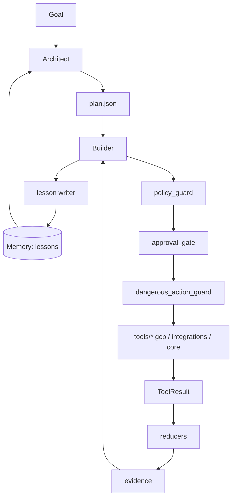
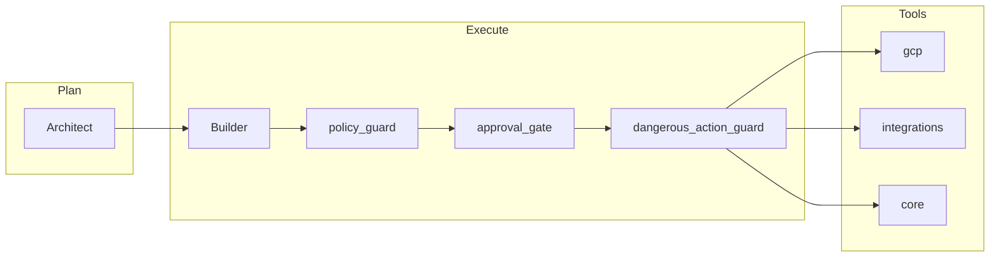

# Architecture

## System overview

The platform is a dual-agent runtime over a shared, safety-gated tool layer. The Architect plans; the Builder executes; the safety chain enforces invariants on every mutating call; reducers compress context; the JSONL memory store closes the self-correction loop.

## Flow

```
Goal -> Architect -> plan.json -> Builder
                                    |
                                    v
                            policy_guard
                                    |
                                    v
                            approval_gate (if requires_approval)
                                    |
                                    v
                            dangerous_action_guard (decorator)
                                    |
                                    v
                            tools/* (gcp, integrations, core)
                                    |
                                    v
                            ToolResult -> reducers -> evidence
                                                    |
                                                    v
                                            memory/ (JSONL lessons)
                                                    |
                                                    v
                                    retrieved on next plan by Architect
```

## Responsibilities

### Architect (`agents/architect/`)
- Decomposes a user goal into structured steps.
- Retrieves relevant lessons via `tools/memory/lesson_retriever.py`.
- Classifies each step via `tools/reducers/policy_guard.py` and routes risky steps to approval.
- Emits a plan JSON consumed by the Builder.

### Builder (`agents/builder/`)
- Executes plan steps by invoking tools.
- Enforces the safety chain on every mutating call.
- Reports per-step structured results.
- Writes a lesson on every failure.

### Domain agents
- **GCP Data Engineering Agent** (`agents/gcp_data_engineering_agent/`): GCS, BigQuery, Cloud Logging, Cloud Run, Discovery Engine, Vertex AI.
- **Story Orchestration Agent** (`agents/story_orchestration_agent/`): Jira, Confluence, Git/GitHub, MCP, delegating cloud ops to the GCP agent.

## Tool-first design

The LLM is a planner/interpreter; tools are the execution boundary. Every tool returns a `ToolResult` (`tools/core/contracts.py`) with `action`, `resources`, `summary`, `evidence`, and `next_steps`. New ad hoc Python is generated only when no tool fits.

## Reducers (token efficiency)

Pure functions under `tools/reducers/` compress context for the prompt:

- `policy_guard` - deterministic action classifier
- `schema_fingerprint` - stable schema digest
- `log_clusterer` - groups noisy logs
- `error_classifier` - normalizes failures
- `repo_indexer` - lightweight code index
- `resource_discovery` - GCP resource summarization
- `sql_template_router` - reusable SQL templates
- `tool_cache` - memoization of idempotent calls
- `artifact_packager` - evidence bundling
- `approval_comment_builder` - human-readable approval payloads

See [tools.md](tools.md).

## Safety stack

- `tools/reducers/policy_guard.py` classifies each action into allow / requires_approval / deny.
- `tools/safety/approval_gate.py` surfaces an approval payload and blocks until a token is supplied.
- `tools/safety/dangerous_action_guard.py` decorates destructive tool entrypoints and enforces token presence.
- `tools/safety/policies.json` is the declarative source of truth for verbs and scopes.

Default semantics: dataset-scope destructive ops are denied; item-scope destructive ops require approval; read-class ops are allowed; unknown verbs fail closed (`requires_approval`). See [safety.md](safety.md).

## Memory and retrieval

Append-only JSONL store under `$DAP_MEMORY_DIR`. Lessons carry tags, signatures, and context for retrieval. Repeated failure signatures are blocked above a threshold to prevent loops. See [memory-and-self-correction.md](memory-and-self-correction.md).

## Integration boundaries

- **Jira / Confluence:** read story, write status, attach evidence (story orchestration only).
- **Git / GitHub:** branch, commit, PR, status checks (delegated through `tools/integrations/github`).
- **GCP:** read/list freely; mutate only via approved verbs.
- **MCP:** treated as another integration surface with the same safety contract.

## Extension points

- Add a tool under `tools/gcp/` or `tools/integrations/`.
- Add a reducer under `tools/reducers/`.
- Add a skill under `prompts/skills/`.
- Extend the policy table in `tools/safety/policies.json`.
- Add a memory schema (additive) under `tools/memory/`.

See [development.md](development.md).

## Roadmap

Pre-release. Stubs are marked in code comments. Public contracts (`ToolResult`, plan JSON, policy table) are stable in spirit but may evolve before v1.0.


## Visual overview




