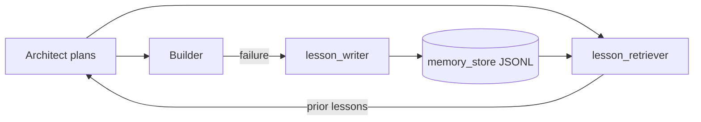
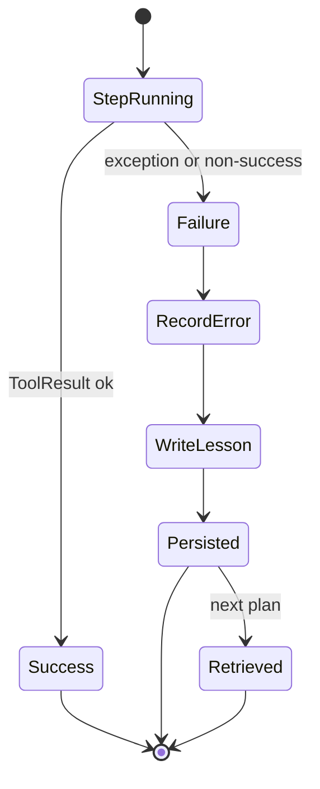

# Memory and Self-Correction

The platform learns from its own failures via an append-only JSONL lesson store. The Architect retrieves relevant lessons before planning; the Builder writes a lesson on every failure.

## Components

- `tools/memory/memory_store.py` - append-only JSONL store under `$DAP_MEMORY_DIR` (default `./memory/`).
- `tools/memory/lesson_writer.py` - `write_lesson(title, context, lesson, tags, store=...)`, `record_error(...)`.
- `tools/memory/lesson_retriever.py` - `retrieve_relevant(tags=..., limit=5, store=...)`, `should_block_repeat(signature, threshold=3)`.

## What gets stored

A lesson record contains:

- `id` and `timestamp`
- `title` and short `context`
- `lesson` (the actionable takeaway)
- `tags` (e.g. `bigquery`, `iam`, `policy_guard`)
- `signature` (a stable hash for repeat-failure detection)
- `evidence` references (never raw secrets)

## What never gets stored

- Credentials, tokens, service-account keys.
- Personally identifying information.
- Raw query results or row contents.
- Customer data.

Writers must redact before persisting. If in doubt, drop the field.

## Lesson lifecycle

1. Builder catches an exception or a non-success `ToolResult`.
2. `record_error(...)` constructs a lesson with a stable `signature`.
3. `write_lesson(...)` appends to the JSONL store.
4. On the next plan, `retrieve_relevant(tags=...)` surfaces the lesson to the Architect.
5. If the same `signature` has appeared >= `threshold` times, `should_block_repeat` returns True and the Architect must replan.

## How user corrections are captured

When a human reviewer rejects a plan or amends an approval, the Architect must call `write_lesson` with `tags=["user_correction", ...]` so future plans avoid the same mistake.

## Retrieval semantics

- Tag-based filter first, then recency.
- Limit defaults to 5 to keep prompt tokens small.
- The retriever returns reduced summaries, not full records.

## Repeat-failure prevention

`should_block_repeat(signature, threshold=3)` blocks loops where the same failure recurs. The Architect must either change the approach or escalate to a human.

## Memory and indexes

The lesson store is not a vector index. It is intentionally simple. Repo-level retrieval (code, schemas) belongs in `tools/reducers/repo_indexer` and `schema_fingerprint`, not in memory.

## Privacy and maintenance

- Treat `$DAP_MEMORY_DIR` as sensitive; redact before sharing.
- Rotate or archive old JSONL files periodically; retention is a deployment policy.
- Never check memory files into git.
- Tests must use a temp `DAP_MEMORY_DIR` (see `tests/memory/`).

## Memory loop

## Lesson lifecycle

