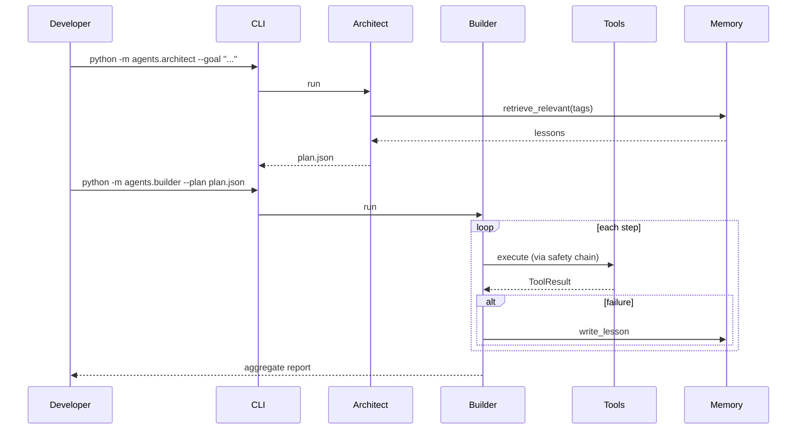
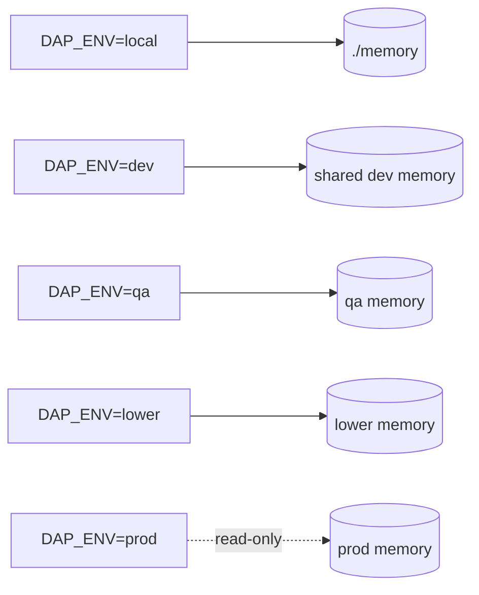

# Usage

Operational guide for running the dual-agent platform locally and in lower environments.

## Install

```bash
git clone https://github.com/jthiruveedula/dual-agent-platform
cd dual-agent-platform
pip install -e .
```

## Environment variables

| Variable | Purpose | Default |
|---|---|---|
| `DAP_MEMORY_DIR` | JSONL lesson memory directory | `./memory/` |
| `GOOGLE_APPLICATION_CREDENTIALS` | GCP auth for tool wrappers | unset |
| `DAP_ENV` | Environment boundary tag (`local`/`dev`/`qa`/`lower`/`prod`) | `local` |

Never put credentials or tokens in code or memory.

## Common commands

```bash
# Run architect to produce a plan
python -m agents.architect --goal "Backfill BQ table x.y for last 7 days"

# Execute a plan
python -m agents.builder --plan plan.json

# Tests and lint
pytest -q
ruff check .
```

## Running tools directly

Tools are importable Python callables under `tools/`. Example:

```python
from tools.gcp import bq
result = bq.list_tables(dataset="analytics", project="my-proj")
```

All tool calls return a `ToolResult` (see `tools/core/contracts.py`).

## Dry-run vs execute

- Architect output is plan-only by default. Nothing mutates until Builder executes.
- For risky steps, Builder will request an approval token via `approval_gate` before invoking `dangerous_action_guard`-decorated tools.

## Approval-gated operations

Operations classified as `requires_approval` will block until an approval token is supplied. See [safety.md](safety.md).

## Lower-environment workflow

1. Set `DAP_ENV=lower` or `qa`.
2. Run plan in dry-run mode and inspect.
3. Execute with explicit approvals for any item-scope destructive ops.
4. Collect evidence; lesson is written automatically on failure.

## Troubleshooting quick reference

| Symptom | Likely cause | Fix |
|---|---|---|
| `policy_guard` denies a known-safe op | Verb not in `policies.json` | Add explicit allow with tests |
| Builder hangs on approval | Missing approval token | Provide token or downgrade verb |
| No lessons retrieved | `DAP_MEMORY_DIR` mismatch | Align env var with prior runs |
| `ruff` fails in CI | Lint drift | `ruff check . --fix` locally |


## End-to-end usage flow



## Local environments


